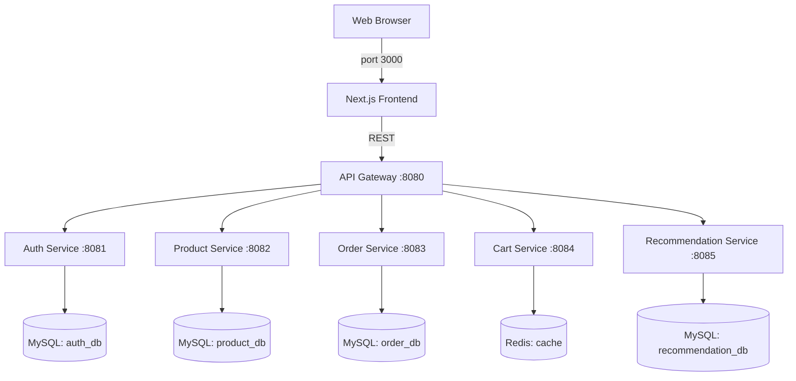

# IceCream Hub 🍦

IceCream Hub is a premium, full-stack e-commerce platform built as a **cloud-native microservices architecture**. It features a high-fidelity Next.js frontend, multiple backend services (Java/Spring Boot & Python/FastAPI), and AI-generated HD assets.

## 🚀 Quick Start (One Command)

The entire platform is containerized and orchestrated via Docker Compose.

```powershell
# Start all 8 services (6 app + 2 infra)
docker-compose up --build -d

# Verify all containers are running
docker ps

# Open the store
http://localhost:3000
```

---

## 🏗️ Architecture

IceCream Hub follows a decentralized microservices pattern. Each service is independently deployable and owns its own data.

For a detailed breakdown of the system design, networking, and service interactions, see [architecture.md](./architecture.md).



---

## ✨ Latest Features (March 2026)

- **Default Admin User**: The Auth Service now automatically provisions a default `admin` / `admin` user on startup for seamless testing and demonstration.
- **Top 1% Luxury Promotion Engine**: The landing page (`/`) is a cinematic masterpiece utilizing `framer-motion`, featuring Apple-tier glassmorphism cards and the signature `floating_ice_cream_hero` visual.
- **Dynamic Session Architecture**: Previously strict, the root route (`/`) now acts as a dynamic hub. Unauthenticated users see the strict "Login to Experience" protocol, whereas active sessions are greeted with a highly colorful, personalized "Welcome [Username] 😂" dashboard and dynamic routing straight to the Catalog.
- **Interactive Catalog**: A powerful client-side search bar allows instant filtering of the premium catalog by name or flavor, accompanied by a personalized user greeting.
- **Protected E-Commerce Flow**: The product catalog and cart are now exclusive to authenticated users, ensuring a secure and personalized shopping experience.
- **Smart Profile Dropdown & Minimalist UI**: The main Navigation bar features a clean layout tracking only Cart and Avatar interactions—completely removing redundant "Catalog" links to centralize browsing through the strict home-path (`/`) redirection logic.
- **Empty Cart Routing**: The "Add the products" CTA seamlessly directs users back to the strict `localhost:3000` root handler, funneling them straight into the dynamic catalog.
- **Integrated Cart Cleanup**: Automatic cart clearing upon successful order placement.
- **Smart Catalog**: Dynamic product badges (Best Seller, Artisanal) and popularity-based recommendations.

---

## 🛠️ Technology Stack

| Service | Technology | Data Store |
|---|---|---|
| **Frontend** | Next.js 14, React, CSS Modules | LocalStorage |
| **Auth** | Java 17, Spring Boot, Spring Security, JWT | MySQL |
| **Product** | Java 17, Spring Boot, Hibernate | MySQL |
| **Order** | Java 17, Spring Boot, Feign Client | MySQL |
| **Cart** | Python 3.10, FastAPI | Redis |
| **Recommendation**| Python 3.10, FastAPI | MySQL |
| **Infrastructure** | Docker, Docker Compose | - |

---

## 📂 Project Structure

- `frontend/`: Next.js application with premium design tokens.
- `auth-service/`: Identity and Access Management with auto-reg.
- `product-service/`: Catalog management with AI asset support.
- `cart-service/`: High-speed session cart (Redis-backed).
- `order-service/`: Order lifecycle and service orchestration.
- `recommendation-service/`: Popularity and trend analytics.

---

> **Maintained by:** [Akhil](https://github.com/akhil)  
> **Status:** Production v2.0 Live 🍨
