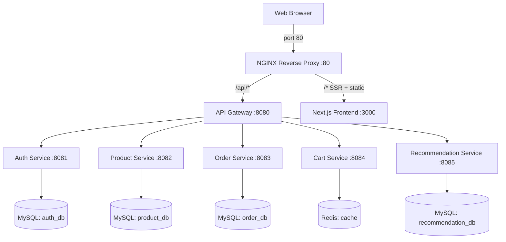

# IceCream Hub 🍦

IceCream Hub is a premium, full-stack e-commerce platform built as a **cloud-native microservices architecture**. It features a cinematic Next.js 14 frontend, multiple backend services (Java/Spring Boot & Python/FastAPI), JWT-based authentication with auto-registration, Redis-backed cart management, AI-generated HD product assets, and a **production-grade NGINX reverse proxy** as its unified entry point.

---

## 🚀 Quick Start (One Command)

The entire platform is containerized and orchestrated via Docker Compose.

```powershell
# Start all 11 services (8 app + 2 infra + 1 nginx)
docker-compose up --build -d

# Verify all containers are running
docker ps

# Open the store — NGINX serves on port 80
http://localhost
```

> **Default credentials (auto-seeded on startup):** `admin` / `admin`

---

## 🗏️ Architecture

IceCream Hub follows a decentralized microservices pattern. Each service is independently deployable and owns its own data. **NGINX** is the single public entry point on port `80` — it routes frontend traffic and proxies all `/api/*` calls to the **API Gateway** on port `8080`, which then forwards to individual microservices.

For a full breakdown see [architecture.md](./architecture.md).



---

## ✨ Latest Features (March 2026)

### 🌐 NGINX Reverse Proxy (New in v4.0)
- **Single entry point** on **port 80** — no need to remember app ports.
- **Smart routing** — `/api/*` flows go directly to the API Gateway; all other requests are served by Next.js.
- **Static asset caching** — `/_next/static/*` and `/images/*` are cached by NGINX for 7 days / 24 hours respectively using a 100 MB proxy cache zone, dramatically reducing load on the frontend container.
- **Gzip compression** — JS, CSS, JSON, SVG responses compressed at level 6.
- **Security headers** — `X-Frame-Options`, `X-XSS-Protection`, `X-Content-Type-Options`, `Referrer-Policy` added on every response.
- **Health endpoint** — `GET /nginx-health` returns `200 healthy` for liveness checks.
- **Frontend shielded** — Port `3000` is no longer published to the host; NGINX is the only door in.

### 🔐 Authentication & Session Management
- **Auto-Registration**: Users can sign up *or* log in with the same form — first-time credentials auto-register the account, returning credentials authenticate.
- **Default Admin User**: Auth Service auto-provisions `admin` / `admin` on startup for zero-friction testing.
- **JWT-Based Sessions**: All sessions are stored client-side via `localStorage` as a JWT token payload object.
- **Strict Route Protection**: All catalog and cart routes are guarded — unauthenticated users are immediately redirected to `/auth`.
- **Strict Auth-Page Redirection**: Logged-in users who navigate to `/` or `/auth` are instantly bounced to `/products`.

### 🎨 Frontend & UI (Next.js 14)
- **Cinematic Landing Page (`/`)**: Hyper-premium dark design using `framer-motion` scroll-parallax, glassmorphism cards, and an animated loading state ("Initializing Vault…").
- **Hero Background**: Uses AI-generated `floating_ice_cream_hero_new.png` with a parallax scroll effect.
- **Flavor Showcase Grid**: 4-card interactive collection with dynamic per-card color glow effects on hover (`Vanilla Dream`, `Mint Symphony`, `Midnight Espresso`, `Artisan Mango`).
- **Brand Philosophy Section**: Full-bleed lifestyle image panel with an overlaid Michelin Guide quote.
- **"Enter the Vault" CTA**: Cinematic invite to authenticate.

### 📦 Products Catalog (`/products`)
- **Personalized Hero Section**: `Welcome back, {username}` headline with animated gradient text, glow orbs, stats strip (Rating, Flavors count, Organic).
- **Live Search Bar**: Client-side instant filtering by product name or flavor — no page reload needed.
- **Product Cards**: Each card features a dynamic badge (`Best Seller`, `Artisanal`, `Top Rated`, `Unique`, `Staff Pick`), price tag overlay, star rating, hover lift animation, and direct link to the product detail page.
- **Lifestyle Showcase Section**: 3-column AI-image gallery (`Artisanal Craftsmanship`, `Midnight Chocolate`, `Unmatched Purity`).
- **Featured Flavor Row**: Curated horizontal scroll of `Vanilla Dream`, `Strawberry`, `Chocolate`, `Mango` with circular avatar images.

### 🛒 Cart & Orders
- **Redis-Backed Cart**: High-speed session cart via Cart Service (Python/FastAPI + Redis).
- **Automatic Cart Cleanup**: On successful order placement, Order Service calls Cart Service to wipe the cart.
- **My Orders Page (`/orders`)**: Full order history accessible via the profile dropdown.
- **Empty Cart Recovery**: "Add products" CTA routes back to `/` which triggers strict-auth redirection back to the catalog.

### 🧭 Navigation (Navbar)
- **Minimalist Design**: Only **Cart** link and **Profile Avatar** shown when logged in — no redundant catalog nav links.
- **Profile Dropdown**: Shows user display name, email (or "Premium Member"), `Home`, `My Orders`, and `Logout` — positioned via `closest('.profile-dropdown-container')` outside-click dismissal.
- **Avatar Button**: Generates from the first letter of `user.name`, with a pink/purple gradient and glow shadow.
- **Custom Event Bridge**: `auth-change` custom event syncs auth state across tabs/components without page reload.

---

## 🛠️ Technology Stack

| Service | Technology | Data Store |
|---|---|---|
| **NGINX** | nginx:1.25-alpine, proxy_cache, gzip | In-memory (100 MB cache zone) |
| **Frontend** | Next.js 14, React, framer-motion, lucide-react, CSS Modules | localStorage (JWT) |
| **Auth** | Java 17, Spring Boot 3, Spring Security, JWT | MySQL (`auth_db`) |
| **Product** | Java 17, Spring Boot 3, Hibernate, JPA | MySQL (`product_db`) |
| **Order** | Java 17, Spring Boot 3, OpenFeign (inter-service calls) | MySQL (`order_db`) |
| **Cart** | Python 3.10, FastAPI, redis-py | Redis |
| **Recommendation** | Python 3.10, FastAPI, SQLAlchemy + PyMySQL | MySQL (`recommendation_db`) |
| **API Gateway** | Spring Cloud Gateway | — |
| **Infrastructure** | Docker, Docker Compose | Persistent named volumes |

---

## 📂 Project Structure

```
IceCream-Hub/
├── nginx/                  # ★ NEW — NGINX reverse proxy (port 80)
│   ├── Dockerfile          # nginx:1.25-alpine, custom config
│   └── nginx.conf          # Routing, caching, gzip, security headers
├── frontend/               # Next.js 14 app (internal port 3000, no host binding)
│   └── src/
│       ├── app/
│       │   ├── page.tsx           # Landing/Promo page (unauthenticated only)
│       │   ├── auth/page.tsx      # Unified Login + Signup page
│       │   ├── products/page.tsx  # Catalog (protected, auth required)
│       │   ├── products/[id]/     # Product detail page
│       │   ├── cart/page.tsx      # Cart management
│       │   ├── orders/page.tsx    # Order history
│       │   └── checkout/page.tsx  # Checkout flow
│       ├── components/
│       │   └── Navbar.tsx         # Minimalist fixed nav with avatar dropdown
│       └── lib/
│           └── api.ts             # All REST API helper functions
├── auth-service/           # Java/Spring Boot – JWT auth (port 8081)
├── product-service/        # Java/Spring Boot – catalog (port 8082)
├── order-service/          # Java/Spring Boot – checkout (port 8083)
├── cart-service/           # Python/FastAPI – Redis cart (port 8084)
├── recommendation-service/ # Python/FastAPI – analytics (port 8085)
├── api-gateway/            # Spring Cloud Gateway (port 8080)
├── init-scripts/           # MySQL init.sql (creates all 4 DBs)
├── docker-compose.yml      # Full platform orchestration (11 services)
├── architecture.md         # System design & network diagram
├── api-overview.md         # REST API endpoint reference
└── README.md               # This file
```

---

## 🐳 Container Reference

| Container | Host Port | Role |
|---|---|---|
| `icecream-nginx` | **80** ← public entry point | NGINX Reverse Proxy |
| `icecream-frontend` | *(internal only — :3000)* | Next.js SSR App |
| `icecream-gateway` | 8080 | API Entry Point (via Nginx) |
| `icecream-auth` | 8081 | Auth Service |
| `icecream-product` | 8082 | Product Service |
| `icecream-order` | 8083 | Order Service |
| `icecream-cart` | 8084 | Cart Service |
| `icecream-recommendation` | 8085 | Recommendation Service |
| `icecream-mysql` | 3306 | Shared MySQL |
| `icecream-redis` | 6379 | Redis Cache |

### NGINX Route Summary
| Request Path | Proxied To | Cached? |
|---|---|---|
| `/api/*` | `api-gateway:8080` | ❌ (dynamic) |
| `/_next/static/*` | `frontend:3000` | ✅ 7 days |
| `/images/*` | `frontend:3000` | ✅ 24 hours |
| `*.ico, *.png, *.woff2, …` | `frontend:3000` | ✅ 24 hours |
| `/_next/*` (HMR / data) | `frontend:3000` | ❌ |
| `/` and all SSR routes | `frontend:3000` | ❌ (personalised) |
| `/nginx-health` | NGINX itself | — |

### Useful Docker Commands
```powershell
docker-compose up --build -d      # Build & start all services (incl. nginx)
docker-compose down               # Stop all services
docker-compose down -v            # Stop & wipe all volumes
docker-compose logs -f nginx      # Stream NGINX access & error logs
docker-compose logs -f auth-service  # Stream a specific service's logs
docker ps                         # List running containers

# After startup, visit:
http://localhost          # ← NGINX on port 80 (new primary URL)
http://localhost:8080     # ← API Gateway direct (debug only)
```

---

> **Maintained by:** [Akhil Mylaram](https://github.com/AkhilMylaram)  
> **Status:** Production v4.0 Live 🍨 — Last Updated: March 2026
