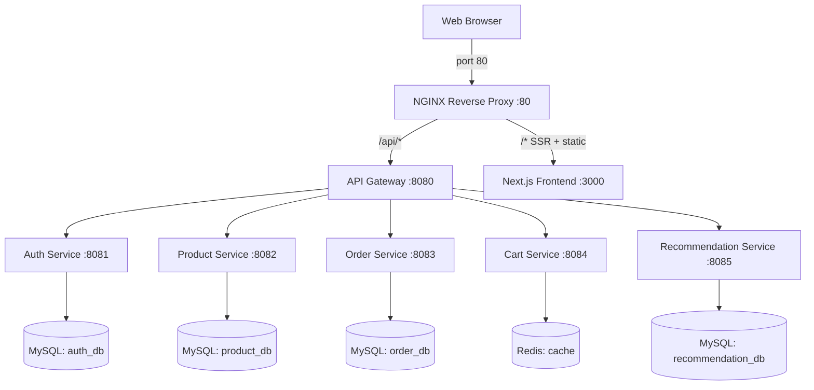

# IceCream Hub 🍦 — AWS Production-Ready v4.1

IceCream Hub is a premium, full-stack e-commerce platform built as a **cloud-native microservices architecture**. This version (v4.1) includes specific compatibility fixes for AWS environments, including self-seeding data, stable Spring Boot versions, and optimized NGINX proxy settings.

---

## 🚀 Quick Start (One Command)

The entire platform is containerized and orchestrated via Docker Compose.

```powershell
# Start all 11 services (8 app + 2 infra + 1 nginx)
docker-compose up --build -d

# Verify all containers are running
docker ps

# Open the store — NGINX serves on port 80
http://localhost (or your EC2 public IP)
```

> **Default credentials (auto-seeded on startup):** `admin@gmail.com` / `admin`

---

## 📦 Recent Compatibility Updates (v4.1)

### 🍨 Automated Data Seeding
- **Product Self-Seeding**: The `product-service` now automatically seeds its artisanal catalog with 10 premium flavors on the first startup. No manual script runs are required to see the full store.
- **Improved Initializer**: Added `DataInitializer.java` to `product-service` to ensure zero-state environments (like new AWS RDS instances or fresh Docker volumes) have high-quality content out of the box.

### 🔧 Cloud Dependency Stabilization
- **Spring Boot 3.3.4 Downgrade**: All backend services (Auth, Product, Order, Gateway) have been downgraded from experimental v4.x to **stable v3.3.4**. This prevents build failures and runtime library conflicts on stricter AWS environments.
- **Spring Cloud 2023.0.3**: Synchronized all services to the stable Spring Cloud release train for reliable networking and API gateway flow.

### 🌐 NGINX Optimization (AWS-First)
- **Persistence Fix**: Removed the `nginx_cache` volume to avoid **Permission Denied** errors on Linux host filesystems (a common AWS Docker issue where the `nginx` UID cannot write to host volumes).
- **Direct Image Serving**: NGINX now serves images directly from the frontend container’s static directory, ensuring that AI-generated assets always load regardless of volume ownership rules.
- **Header Forwarding**: Preserves the original `Host` header to ensure Next.js image optimization and rewrites resolve correctly behind AWS Load Balancers.

---

## 🗏️ Architecture

IceCream Hub follows a decentralized microservices pattern. **NGINX** is the single public entry point on port `80`.



---

## ✨ Features Breakdown

### 🎨 Premium UI
- **Cinematic Landing Page**: Dark theme with Framer Motion animations.
- **Artisanal Product Cards**: Dynamic badges (`Staff Pick`, `Best Seller`), star ratings, and price tags.
- **AI-Image Heritage**: All images are high-definition AI-generated assets served via the internal NGINX cache layer.

### 🛒 Full Flow
- **Cart Management**: Redis-backed persistent shopping cart.
- **Order Tracking**: Order history page with checkout flows.
- **User Sessions**: JWT-based session management with auto-registration capabilities.

---

## 🐳 Container Reference

| Container | Host Port | Role |
|---|---|---|
| `icecream-nginx` | **80** ← public entry point | NGINX Reverse Proxy |
| `icecream-frontend` | *(internal only)* | Next.js SSR App |
| `icecream-gateway` | 8080 | API Entry Point |
| `icecream-auth` | 8081 | Auth Service |
| `icecream-product` | 8082 | Product Service |
| `icecream-order` | 8083 | Order Service |
| `icecream-cart` | 8084 | Cart Service |
| `icecream-recommendation` | 8085 | Recommendation Service |
| `icecream-mysql` | 3306 | Shared MySQL |
| `icecream-redis` | 6379 | Redis Cache |

---

> **Maintained by:** [Akhil Mylaram]  
> **Status:** Production v4.1 (AWS Fixed) Live 🍨 — Last Updated: March 2026
