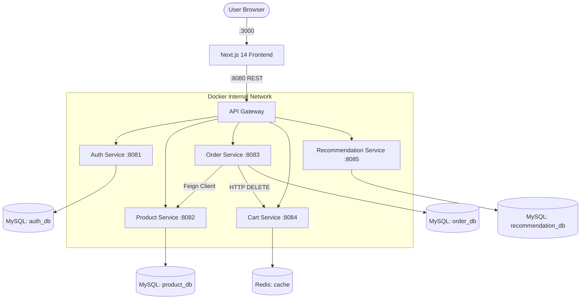

# 🏢 IceCream Hub Architecture

IceCream Hub is a modern e-commerce platform built using a **decentralized microservices architecture**. It is designed for scalability, high availability, and rapid deployment through full Docker containerization.

---

## 🔍 System Context Diagram

The following diagram illustrates the high-level interactions between the user, the frontend, and the backend services.

---

## 🌐 Networking & Discovery

- **Docker Compose Network**: All services reside on a single dedicated internal bridge network (`icecream-network`).
- **Service Discovery**: Microservices communicate using Docker Compose container names (e.g., `http://auth-service:8081`, `http://cart-service:8084`) rather than fixed IP addresses.
- **External Exposure**: Only the **Frontend (3000)** and **API Gateway (8080)** are exposed to the host machine; all backend service ports are also mapped for local development convenience.
- **Frontend API Routing**: The Next.js frontend proxies all `/api/*` calls to `http://api-gateway:8080` via `AUTH_SERVICE_URL`, `PRODUCT_SERVICE_URL`, etc. environment variables set in `docker-compose.yml`.

---

## 📦 Microservices Breakdown

### 1. Frontend — Next.js 14 (Port 3000)
- **Technology**: Next.js 14, React, `framer-motion`, `lucide-react`, CSS Modules.
- **Key Pages**:
  - `/` — Cinematic promo landing (unauthenticated only; auto-redirects logged-in users to `/products`).
  - `/auth` — Unified Login/Signup (also auto-redirects logged-in users).
  - `/products` — Protected catalog with live search, badge-tagged product cards, lifestyle showcase.
  - `/products/[id]` — Product detail with add-to-cart.
  - `/cart` — Cart view with checkout CTA.
  - `/orders` — Order history (accessible via profile dropdown).
  - `/checkout` — Checkout completion.
- **Auth Strategy**: JWT token payload stored in `localStorage` as `user` key. Custom `auth-change` event broadcast on login/logout for cross-component sync.
- **Route Guards**: Client-side — `/products`, `/cart`, `/orders`, `/checkout` redirect to `/auth` if no session. `/`, `/auth` redirect to `/products` if session exists.

### 2. Auth Service — Java/Spring Boot (Port 8081)
- **Responsibility**: User registration, login, JWT token generation, and auto-provisioning.
- **Key Feature — Auto-Registration**: Backend logic supports first-time-login auto-registration flows.
- **Key Feature — Default Admin**: `admin` / `admin` credentials are seeded on application startup via a `CommandLineRunner` or similar bootstrap mechanism.
- **Security**: JWT signed tokens. Spring Security configured to permit `/api/auth/**` without authentication.
- **Data Store**: MySQL `auth_db` with a `users` table managed via Hibernate `ddl-auto: update`.
- **Config**: Uses `org.hibernate.dialect.MySQLDialect` (not the deprecated `MySQL8Dialect`).

### 3. Product Service — Java/Spring Boot (Port 8082)
- **Responsibility**: Manages the premium ice cream catalog: names, flavors, prices, descriptions, and AI-generated image paths.
- **Data Store**: MySQL `product_db`. Product `imageUrl` fields point to files in `/images/` served from the Next.js `public/` directory.
- **Seeded Products**: `Vanilla Dream` ($4.99), `Double Chocolate` ($5.49), `Strawberry Fields` ($4.99) — each with a timestamped AI-generated PNG.
- **Image Naming Pattern**: `/images/{flavor}_ice_cream_{timestamp}.png`.

### 4. Cart Service — Python/FastAPI + Redis (Port 8084)
- **Responsibility**: High-speed, transient shopping cart management per `userId`.
- **Data Store**: Redis — all cart data is stored as Redis hashes/JSON keyed by `cart:{userId}`.
- **Networking Config**: Uses `REDIS_HOST` env variable (set to `redis` in Compose) — not hardcoded `localhost`.
- **Auto-Clear**: Cart is deleted by Order Service after a successful order via `DELETE /api/cart/{userId}`.

### 5. Order Service — Java/Spring Boot (Port 8083)
- **Responsibility**: Full checkout lifecycle management.
- **Inter-Service Calls**:
  - **Feign Client → Product Service**: Validates product existence and pricing before creating an order.
  - **HTTP DELETE → Cart Service**: Clears the user's cart after successful order creation via `CART_SERVICE_URL` env variable.
- **Data Store**: MySQL `order_db`.

### 6. Recommendation Service — Python/FastAPI + MySQL (Port 8085)
- **Responsibility**: Popularity-based product analytics and discovery.
- **Algorithm**: Ranks products by `order_count` in `recommendation_db`. No direct runtime dependency on other live services.
- **Networking Config**: Uses `DATABASE_URL` env variable (`mysql+pymysql://...`) — not hardcoded `localhost`.

### 7. API Gateway — Spring Cloud Gateway (Port 8080)
- **Responsibility**: Single entry point for all client → microservice communication.
- **Routing**: Path-prefix based — `/api/auth/**` → auth-service, `/api/products/**` → product-service, etc.
- **Benefits**: Decouples the frontend from needing to know individual service ports; enables future auth middleware injection at the gateway level.

---

## 🗏️ Data Isolation

Each service owns exactly one database — there is **no shared schema**:

| Service | Database | Notes |
|---|---|---|
| Auth | `auth_db` | Independent. No outbound service calls. |
| Product | `product_db` | Independent. Referenced by Order & Recommendation, but makes no outbound calls. |
| Cart | Redis `icecream-redis` | Independent. No MySQL. No inter-service calls. |
| Order | `order_db` | Depends on Product (Feign) and Cart (HTTP DELETE) at runtime. |
| Recommendation | `recommendation_db` | Depends on MySQL only. No runtime service dependencies. |

All MySQL databases are created by `init-scripts/init.sql` which runs on the MySQL container's first boot.

---

## 🗏️ Deployment Strategy

The application is fully containerized using **Docker**. The `docker-compose.yml` orchestrates **9 containers**:

- **Multi-stage Gradle builds** for Java services (Eclipse Temurin JDK base image + local `gradlew` wrapper matching project's Gradle 9.3.1).
- **Lightweight Python images** (`python:3.10-slim` + uvicorn) for FastAPI services.
- **Node.js Alpine** (`node:20-alpine`) for the Next.js production build.
- **Health-check ordering** via `depends_on` with `condition: service_healthy` on MySQL and Redis.
- **Persistent named volumes** (`mysql_data`, `redis_data`) for data safety across restarts.
- **Environment variable injection** for all inter-service URLs and credentials.

### Known Bug Fixes Applied During Dockerization
| Issue | Fix |
|---|---|
| Hibernate `MySQL8Dialect` deprecated | Changed to `org.hibernate.dialect.MySQLDialect` |
| Gradle image mismatch | Replaced `gradle:8.5` Docker image with local `./gradlew` wrapper (Gradle 9.3.1) |
| ESLint unescaped entity | `haven't` → `haven&apos;t` in cart page |
| Docker symlink conflict (acorn) | Added `frontend/.dockerignore` excluding `node_modules`, `.next`, `.git` |
| Next.js font network timeout | Replaced `next/font/google` (network call) with local font fallback during Docker build |
| Python hardcoded `localhost` | Replaced with `REDIS_HOST` / `DATABASE_URL` environment variables |

---

## 🖼️ AI-Generated Assets

All product and lifestyle images are AI-generated and stored in `frontend/public/images/`:

| File | Used In |
|---|---|
| `floating_ice_cream_hero_new.png` | Landing page hero + Products page hero background |
| `vanilla_ice_cream_{ts}.png` | Vanilla Dream product card |
| `chocolate_ice_cream_{ts}.png` | Double Chocolate product card |
| `strawberry_ice_cream_{ts}.png` | Strawberry Fields product card |
| `flavor_vanilla_dream_new.png` | Landing page collection card |
| `mint.png` | Mint Symphony collection card |
| `espresso.png` | Midnight Espresso collection card |
| `mango.png` | Artisan Mango collection card + Featured row |
| `midnight_chocolate.png` | Lifestyle showcase grid |
| `lifestyle_1.png` | Brand philosophy section + Lifestyle grid |
| `lifestyle_2.png` | Lifestyle showcase grid |

---

> **Architecture Documented by:** Akhil Mylaram  
> **Last Updated:** 2026-03-07 — v3.0 Architecture
