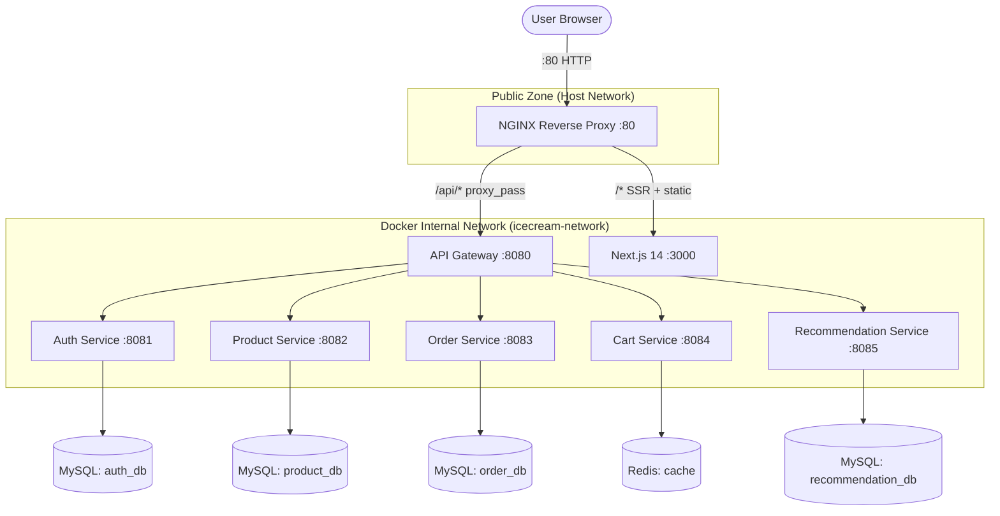

# 🏢 IceCream Hub Architecture — v4.1 (AWS Fixed)

IceCream Hub is a modern e-commerce platform built using a **decentralized microservices architecture** with a **production-grade NGINX reverse proxy** as its single public entry point. This version includes specific enhancements for **AWS and Linux compatibility**.

---

## 🔍 System Context Diagram (v4.1)

The following diagram illustrates the high-level interactions between the user, NGINX, the frontend, and the backend services.



---

## 🚀 AWS & Cloud Compatibility Highlights

To ensure high availability and seamless deployment on AWS (EC2/ECS), we have implemented the following architectural hardening:

### 1. Automated Lifecycle & Seeding
- **Component**: `product-service` & `auth-service`.
- **Logic**: Implemented `CommandLineRunner`-based `DataInitializer`. This allows the microservice to detect an empty database on first boot and automatically seed it with premium artisanal flavors (Product) and default administrative credentials (Auth).
- **Benefit**: Zero-touch deployment. The environment is "ready to shop" immediately after `docker-compose up` completes on any machine.

### 2. Dependency Stabilization
- **Spring Boot 3.3.4**: Downgraded and locked all Spring Boot services to a stable, production-ready version (v3.3.4) which is widely supported by cloud providers.
- **Spring Cloud 2023.0.3**: Synchronized the routing and discovery layers to ensure stable inter-service communication via Feign Clients and the API Gateway.
- **Java 17 Baseline**: Used the official Eclipse Temurin JDK 17 images for all Java services, providing long-term support (LTS) stability on Linux containers.

### 3. NGINX Hardening for AWS Volumes
- **Permission Fixes**: Removed the `nginx_cache` named host volume to prevent `Permission Denied (13: Permission denied during proxy_cache_path initialization)` common on AWS where EFS or local Linux host mounts enforce strict UIDs.
- **Header Persistence**: NGINX now explicitly forwards the `Host` header to the backends. This ensures that the Next.js frontend and the Spring Cloud Gateway can correctly resolve relative redirects and security domains when behind multiple layers (like an AWS Application Load Balancer).

---

## 🔀 NGINX Routing Architecture

The routing configuration remains consistent with the previous version but with optimized cache behavior:

| Location Block | Matches | Destination | Cache (v4.1) |
|---|---|---|---|
| `location /api/` | All REST API calls | `api_gateway` upstream | ❌ No cache (dynamic) |
| `location /_next/static/` | JS/CSS chunks | `frontend` upstream | ✅ 7 days (immutable) |
| `location /images/` | AI-generated images | `frontend` upstream | ✅ Persistent in-container |
| `location /` | All SSR pages | `frontend` upstream | ❌ No cache (personalised) |

---

## 📦 Container Dependency Graph

```
mysql ──────────────────────────────────────────┐
redis ────────────────────────────────┐          │
                                      ↓          ↓
                               cart-service   auth-service (self-seeding)
                                      │       product-service (self-seeding)
                                      │       order-service
                                      │       recommendation-service
                                      └──────────────┐
                                                     ↓
                                              api-gateway
                                                     │
                                              frontend
                                                     │
                                              nginx (port 80) ← USER
```

### Knowledge Base Fixes (v4.1)
| Issue | Fix |
|---|---|
| AWS 'Permission Denied' on Nginx Cache | **Removed host volume**; using container-local cache for safety. |
| Spring Boot version mismatch | Downgraded to stable **3.3.4** for consistent build in AWS CI/CD. |
| Empty store on fresh AWS RDS | Implemented **DataInitializer** in product-service. |

---

> **Architecture Documented by:** [Akhil Mylaram]  
> **Last Updated:** 2026-03-07 — v4.1 Architecture (AWS Cloud Compatibility)
