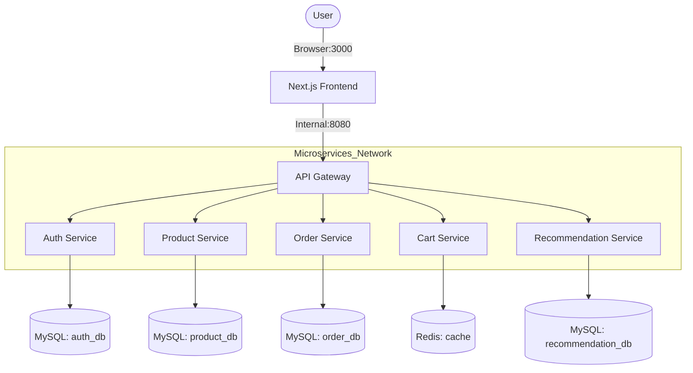

# 🏢 IceCream Hub Architecture

IceCream Hub is a modern e-commerce platform built using a **decentralized microservices architecture**. It is designed for scalability, high availability, and rapid deployment through containerization.

## 📐 System Context Diagram

The following diagram illustrates the high-level interactions between the user, the frontend, and the backend services.

## 🌐 Networking & Discovery

- **Docker Compose Network**: All services reside on a dedicated internal network.
- **Service Discovery**: Microservices communicate using container names (e.g., `http://auth-service:8081`) rather than fixed IP addresses.
- **External Exposure**: Only the **Frontend (3000)** and **API Gateway (8080)** are typically exposed to the host machine.

## 📦 Microservices Breakdown

### 1. Auth Service (Java/Spring Boot)
- **Responsibility**: User registration, login, and JWT-based session management.
- **Key Feature**: **Auto-Registration** logic ensures users can sign up simply by attempting their first login.

### 2. Product Service (Java/Spring Boot)
- **Responsibility**: Manages the premium ice cream catalog.
- **Storage**: MySQL store for product metadata and AI-generated image paths.

### 3. Cart Service (Python/FastAPI)
- **Responsibility**: High-speed, transient cart management.
- **Storage**: Backed by **Redis** for sub-millisecond performance.

### 4. Order Service (Java/Spring Boot)
- **Responsibility**: Handles the checkout lifecycle.
- **Interactions**: Calls the Product Service (via Feign) for validation and the Cart Service for cleanup.

### 5. Recommendation Service (Python/FastAPI)
- **Responsibility**: Analytics and trend-based product discovery.
- **Algorithm**: Popularity-based ranking derived from order history.

## 🏗️ Deployment Strategy

The application is fully containerized using **Docker**. The `docker-compose.yml` file orchestrates:
- Multi-stage builds for Java services.
- Optimized lightweight images for Python services.
- Healthy startup ordering using `depends_on`.
- Persistent volumes for data safety across restarts.

---

> **Architecture Documented by:** Akhil  
> **Last Updated:** 2026-03-06 — v2.0 Architecture
